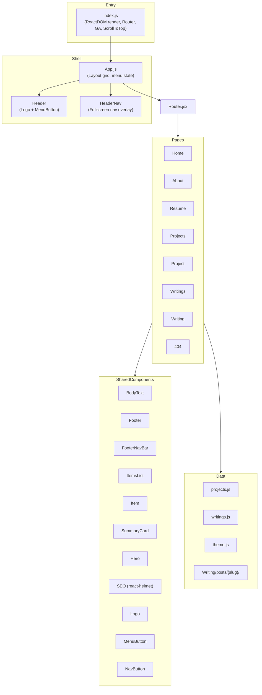

# Architecture

## Overview

Personal portfolio and blog site built as a single-page application with React 16. Uses an ejected Create React App setup for full webpack control.

## High-Level Architecture

## Design Patterns

- **CSS-in-JS**: styled-components with template literal `css` prop throughout
- **Component model**: Mostly class components; a few functional components (Home, Header, ErrorPage, FollowBanner)
- **State management**: Local component state only — no Redux/Context
- **Routing**: react-router-dom v5 with `<Switch>` / `<Route>` / `<Redirect>`
- **SEO**: react-helmet wrapper component (`Seo.jsx`) on every page
- **Analytics**: react-ga initialized in `index.js`, tracks page views via history listener
- **Content**: Blog posts as markdown files loaded at runtime via `fetch()`, with `meta.js` sidecar for metadata
- **Responsive layout**: CSS Grid on App shell; media queries at 767px / 768px / 992px / 1200px breakpoints
- **Typography**: `BodyText` component with `sizer` multiplier and `altText` flag to toggle between Bitter (serif) and Dosis (sans-serif)

## Layout System

The App shell uses a CSS Grid with named areas:
- `Header` — top row, contains Logo + MenuButton
- `Content` — main content area, renders the active route
- Columns scale from 7-col (mobile/tablet) to 9-col (desktop ≥1200px)

The `HeaderNav` overlay is a grid-based fullscreen navigation menu toggled by `showMenu` state in App.
