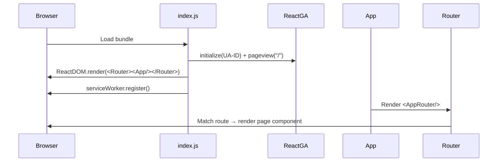
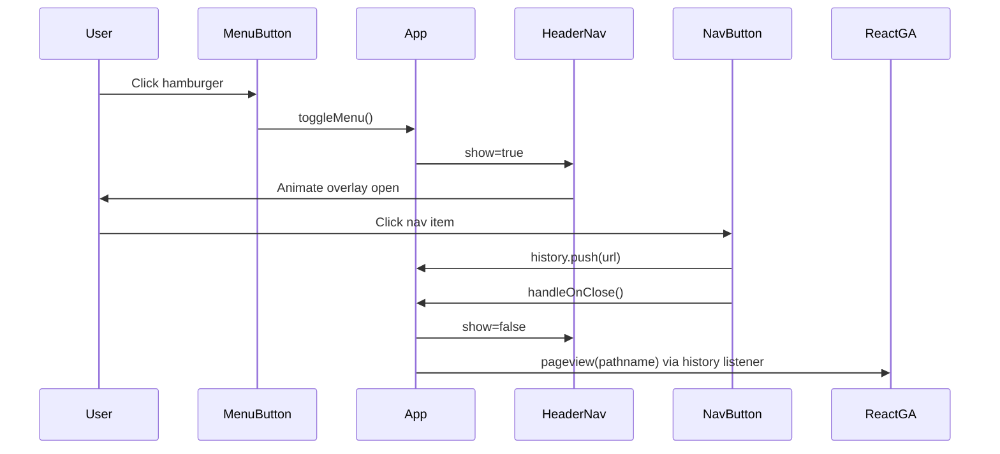
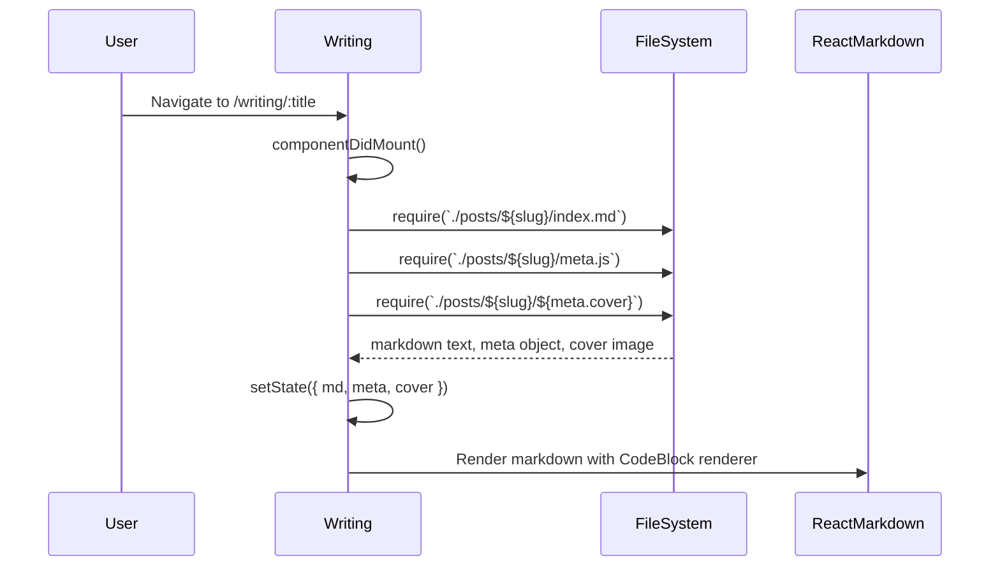

# Workflows

## Application Startup

## Navigation Flow

## Blog Post Loading

## Adding a New Blog Post

1. Create directory: `src/pages/Writing/posts/{slug}/`
2. Add `index.md` with article content
3. Add `meta.js` exporting `{ title, date, cover, keywords }`
4. Add cover image file
5. Add entry to `src/writings.js` array with `url: "{slug}"`, `published: true`

## Adding a New Project

1. Add entry to `src/projects.js` object with a unique key matching the desired URL slug
2. Fill in all fields: `url`, `title`, `subtext`, `headline`, `info`, `use`, `repo`, optionally `demo`
